# 基金的学习

​	基金的学习将分为以下几个部分，后续还会添加，其实不用管那么多，基金最重要的还是学会入场和止盈即可，没耐心的直接看入场和止盈即可。

ps:买入卖出手续费也很重要，别没事一直操作，你是来赚钱的，不是来给基金经理打工的，买之前先看看买入卖出手续费。

* 基金的基本概念
* 基金分类
* 基金术语解释大全
* 买入卖出手续费
* 入场时间
* 止盈策略

### 基金的基本概念

何为基金：

​	证券投资基金是一种利益共享、风险共担的集合证券投资方式，即通过发行基金单位，集中投资者的资金，由基金托管人托管，由基金管理人管理和运用资金，从事股票、债券、外汇、货币等金融工具投资，以获得投资收益和资本增值。投资基金在不同国家或地区称谓有所不同，美国称为"共同基金"，英国和香港称为"单位信托基金"，日本和台湾称为"证券投资信托基金"。

### 基金的分类

* 按募集方式分：**分公募基金和私募基金**。

* 按基金的用途分：**(1) 证券投资基金(2) 创业基金(3) 对冲基金**

#### 证券投资基金的分类

* 根据基金单位是否可增加或赎回，投资基金可分为**开放式基金**和**封闭式基金**

* 根据组织形态的不同，投资基金可分为**公司型投资基金和契约型投资基金**

* 根据投资风险与收益的不同，投资基金可分为**成长型投资基金、收入型投资基金和平衡型投资基金**

* 根据投资对象的不同，投资基金可分为**股票基金、债券基金、货币市场基金、混合基金、期货基金、期权基金，指数基金和认股权证基金**等

* 根据投资货币种类，投资基金可分为**美元基金、日元基金和欧元基金**

* 根据资本来源和运用地域的不同，投资基金可分为**国际基金、海外基金、国内基金，国家基金和区域基金**

### 基金术语解释大全

#### 基本分类术语

**1、创业基金**

又称风险资本，它的投资目标主要是那些不具备上市资格的小企业和新兴企业，甚至是那些还处于构思之中的企业。通常都属于私募，投资周期也较长。在我国，通常所说的“产业投资基金”即属于创业基金。

**2、对冲基金**

英文名称为Hedge Fund，意为“风险对冲过的基金”，原意是利用期货、期权等金融衍生产品，对相关联的不同股票空买空卖。风险对冲的操作，在一定程度上可规避和化解证券投资风险。

**3、公募基金**

公募基金是指受我国政府主管部门监管的，向不特定投资者公开发行受益凭证的证券投资基金。例如目前国内证券市场上的封闭式基金属于公募基金。

**4、私募基金**

私募基金是指非公开宣传的，私下向特定投资者募集资金进行的一种集合投资。

**5、开放式基金**

开放式基金是指基金发行总额不固定，基金单位总数随时增减，投资者可以按基金的报价在国家规定的营业场所申购或者赎回基金单位的一种基金。

**6、封闭式基金**

封闭式基金是指事先确定发行总额，在封闭期内基金单位总数不变，基金上市后投资者可以通过证券市场转让、买卖基金单位的一种基金。

**7、公司型投资基金**

基金公司本身为一家股份有限公司，公司通过发行股票或受益凭证的方式来筹集资金。投资者购买了该家公司的股票，就成为该公司的股东，凭股票领取股息或红利、分享投资所获得的收益。公司型基金在法律上是具有独立“法人”地位的股份投资公司。

**8、契约型投资基金**

契约型基金又称单位信托基金，是指把投资者、管理人、托管人三者作为当事人，通过签订基金契约的形式发行受益凭证而设立的一种基金。

**9、有限合伙基金**

有限合伙基金是指一名以上普通合伙人与一名以上有限合伙人所组成的合伙，它是介于合伙与有限责任公司之间的一种企业形式。有限合伙人不参与有限合伙企业的运作，不对外代表组织，只按合伙协议比例享受利润分配，以其出资额为限对合伙的债务承担清偿责任。普通合伙人参与合伙事务的管理，分享合伙收益，每个普通合伙人都对合伙债务负无限责任或者连带责任。

**10、成长型基金**

成长型基金是这是基金中最常见的一种。该类基金资产的长期增值。为了达到这一目标，基金管理人通常将基金资产投资于信誉度较高的、又长期成长前景或长期盈余的公司的股票。

**11、收入型基金**

收入型基金是主要投资于可带来现金收入的有价证券，以获取当期的最大收入为目的。收入型基金资产成长的潜力较小，损失本金的风险相对也较低，一般可分为固定收入型基金和权益收入型基金。

**12、平衡型基金**

平衡型基金是其投资目标是既要获得当期收入，又要追求长期增值，通常是把资金分散头在于股票和债券，以保证资金的安全性和赢利性。

**13、股票型基金**

所谓股票型基金，是指60%以上的基金资产投资于股票的基金，其他资金投入到债券或其他的证券，我国有关法规规定，基金资产的不少于20%的资金必须投资国债。国内所有上市交易的封闭式基金及大部分的开放式基金都是股票基金。

**14、债券型基金**

债券基金是指全部或大部分投资于债券市场的基金。假如全部投资于债券，可以称其为纯债券基金，假如大部分基金资产投资于债券，少部分可以投资于股票，可以称其为债券型基金，

**15、货币市场基金**

货币市场基金是投资于银行定期存款、商业本票、承兑汇票等风险低、流通性高的短期投资工具的基金品种，因此具有流通性好、低风险与收益较低的特性。

**16、指数基金**

指数基金(Index Fund)，顾名思义就是以特定指数（如沪深300指数、标普500指数、纳斯达克100指数、日经225指数等）为标的指数，并以该指数的成份股为投资对象，通过购买该指数的全部或部分成份股构建投资组合被，以追踪标的指数表现的基金产品。

**17、混合基金**

混合基金是指同时投资于股票、债券和货比市场等工具，没有明确的投资方向的基金。其风险低于股票基金，预期收益则高于债券基金。它为投资者提供了一种在不同资产之间进行分散投资的工具，比较适合较为保守的投资者。

**18、偏股型基金**

以股票投资为主，股票投资配置比例的中值大于债券资产的配置比例的中值，二者之间的差距一般在10%以上。差异在5%～10%之间者辅之以业绩比较基准等情况决定归属。

**19、偏债型基金**

以债券投资为主，收益适中，收益比债券收益较多，但是风险也较其大。其中债券投资配置比例的中值大于股票资产的配置比例的中值，二者之间的差距一般在10%以上。差异在5%～10%之间者辅之以业绩比较基准等情况决定归属。

**20、认股权证基金**

此类型基金主要投资于认股权证，基于认股权证有高杠杆、高风险的产品特性，此类型基金的波动幅度亦较股票型基金为大。

**21、期货基金**

期货投资基金简称期货基金(CTA Fund)，或商品基金，是指广大投资者将资金集中起来，委托给专业的期货投资机构，并通过商品交易顾问(CTA)进行期货投资交易，投资者承担投资风险并享有投资利润的一种集合投资方式。

**22、期权基金**

期权基金是以期权为主要投资对象的投资基金。期权也是一种合约，是指在一定时期内按约定的价格买入或卖出一定数量的某种投资标的的权利。

**23、黄金基金和衍生证券基金**

黄金基金和衍生证券基金是指以投资于黄金或其它贵金属及其生产和相关产业的证券为主要对象的基金和以衍生证券为投资对象的基金。

**24、保本基金**

保本基金(Guaranteed Fund)：就是在一定期间内，对所投资的本金提供一定比例的保证保本基金，基金利用利息或是极小比例的资产从事高风险投资，而将大部份的资产从事固定收益投资，使得基金投资的市场不论如何下跌时，绝对不会低于其所担保的价格，而达到所谓的「保本」作用。

**25、QDII基金**

经该国有关部门批准从事境外证券市场的股票、债券等有价证券业务的证券投资基金。和QFII一样，它也是在货币没有实现完全可自由兑换、资本项目尚未开放的情况下，有限度地允许境内投资者投资境外证券市场的一项过渡性的制度安排。

**26、QFII基金**

在QFII制度下，合格的境外机构投资者（QFII）将被允许把一定额度的外汇资金汇入并兑换为当地货币，通过严格监督管理的专门账户投资当地证券市场，包括股息及买卖价差等在内的各种资本所得，经审核后可转换为外汇汇出，实际上就是对外资有限度地开放本国证券市场。

**27、交易型开放式指数基金（ETF）**

是一种在交易所上市交易的、基金份额可变的一种开放式基金。交易型开放式指数基金属于开放式基金的一种特殊类型，它结合了封闭式基金和开放式基金的运作特点，投资者既可以向基金管理公司申购或赎回基金份额，同时，又可以像封闭式基金一样在二级市场上按市场价格买卖ETF份额，不过，申购赎回必须以一揽子股票换取基金份额或者以基金份额换回一揽子股票。由于同时存在证券市场交易和申购赎回机制，投资者可以在ETF市场价格与基金单位净值之间存在差价时进行套利交易。套利机制的存在，使得ETF避免了封闭式基金普遍存在的折价问题。

**28、上市型开放式基金（LOF）**

LOF(Listed Open-end fund)的投资者既可以通过基金管理人或其委托的销售机构以基金净值进行基金的申购、赎回，也可以通过交易所市场以交易系统撮合成交价进行基金的买入、卖出。

**29、国际基金、海外基金、国内基金，国家基金和区域基金**

国际基金是指资本来源于国内，并投资于国外市场的投资基金；海外基金也称离岸基金。是指资本来源于国外，并投资于国外市场的投资基金；同内基金是指资本来源于国内，并投资于国内市场的投资基金；国家基金是指资本来源于国外，并投资于某一特定国家的投资基金；区域基金是指投资于某个特定地区的投资基金

**30、伞型基金**

是指在一个母基金之下再设立若干个子基金，各子基金独立进行投资决策的基金运作模式。其主要特点是在基金内部可以为投资者提供多种选择，投资者可根据自己的需要转换基金类型（不用支付转换费用），在不增加成本的情况下为投资者提供一定的选择余地。

**31、基金中的基金（FOF）**

基金中的基金（FOF）与开放式基金最大的区别在于基金中的基金是以基金为投资标的，而基金是以股票、债券等有价证券为投资标的。它通过专业机构对基金进行筛选，帮助投资者优化基金投资效果。

**32、多管理人基金（MOM）**

多管理人基金是指基金经理不直接将基金资产投资于诸如股票、债券等证券产品，而是用来投资于其他基金或者直接将基金资产委托给其他基金经理来管理。这类基金的特点是专业筛选优秀基金或者基金经理，形成实质上的投资决策权限外移和分散化，标志着基金从专业管理其他资产进入了专业管理基金的新阶段。

**33、专向基金**

专向基金（Specialty Funds）是指将资金专门投资与某一特定行业领域的股票基金产品。相对与一般股票基金而言，专项基金有效的缩小了投资范围，在选择投资对象方面具有更强的针对性；基金管理人可以把主要的研发精力集中于既定的行业领域，不仅提高了投资管理的专业化程度，也在一定程度上降低了管理成本。以美国的基金行业为例，较为常见的专向基金的投资领域包括了高科技、大众传媒、健康护理、金融、公用事业、自然资源、房地产等等。

**34、偿债基金**

偿债基金亦称"减债基金"。国家或发行公司为偿还未到期公债或公司债而设置的专项基金；很多发达国家都设立了偿债基金制度。日本的偿债基金制度，是在日本明治39年根据国债整理基金特别会计法确定的。偿债基金是一般是在债券实行分期偿还方式下才予设置。偿债基金一般是每年从发行公司盈余中按一定比例提取，也可以每年按固定金额或已发行债券比例提取。

**35、政府公债基金**

政府公债基金指专门投资于直接或间接由政府担保的有价证券的基金。技资对象包括国库券、国库本票、政府债券及政府机构发行的债券。投资于这种基金的最大优点是安全性高。因为它有政府担保，收益相对稳定，且流动性也大。

#### 基金组织类术语

**1、基金契约**

基金契约就是一份“委托理财协议”。是基金管理人、基金托管人、基金投资者为设立基金而订立的用以明确基金当事人各方权利和义务关系的书面法律文件。基金契约的主要内容包括：基金的持有人、管理人、托管人的权利与义务；基金的发行、购买、赎回与转让等；基金的投资目标、范围、政策和限制；基金资产的估值方法；基金的信息批露；基金的费用；收益分配与税收；基金终止与清算。

**2、基金管理人**

基金管理人是指具有专业的投资知识与经验，根据法律、法规及基金章程或基金契约的规定，经营管理基金资产，谋求基金资产的不断增值，以使基金持有人收益最大化的机构。

**3、基金托管人**

基金托管人是投资人权益的代表，是基金资产的名义持有人或管理机构。为了保证基金资产的安全，按照资产管理和资产保管分开的原则运作基金，基金设有专门的基金托管人保管基金资产。

**4、基金持有人大会**

基金持有人大会是由全体基金单位持有人或委托代表参加。主要讨论有关基金持有人利益的重大事项，如修改基金契约，终止基金，更换基金托管人，更换基金管理人，延长基金期限，变更基金类型，以及召集人认为要提交基金持有人大会讨论的其他事项。

**5、基金托管协议**

基金托管协议是基金管理人与基金托管人（一般为商业银行）就基金资产托管一事达成的协议书。协议书以合同的形式明确委托人和托管人的责任和权利、义务关系。

**▎基金交易类术语**

**1、基金成立日**

基金成立日是指基金达到成立条件后，基金管理人宣布基金成立的日期。

**2、基金募集期**

基金募集期是指自招募说明书公告之日起到基金成立日的时间段。

**3、基金存续期**

基金存续期是指基金发行成功，并通过一段时间的封闭期后，称作基金的存续期。

**4、基金单位**

基金单位是指基金发起人向不特定的投资者发行的，表示持有人对基金享有资产所有权、收益分配权和其他相关权利，并承担相应义务的凭证。

**5、基金开放日**

基金开放日就是可以办理开放式基金的开户、申购、赎回、销户、挂失、过户等等一系列手续的工作日。对于一只开放式基金来说，并不是在任何一个工作日都可以进行交易，因此，规定每周的某几个工作日进行交易，这几个工作日就称为开放日。

**6、基金认购**

基金认购是指投资者在开放式基金募集期间、基金尚未成立时购买基金单位的过程。通常认购价为基金单位面值（1元）加上一定的销售费用。投资者认购基金应在基金销售点填写认购申请书，交付认购款项。

**7、基金申购**

基金申购是指投资者到基金管理公司或选定的基金代销机构开设基金帐户，按照规定的程序申请购买基金单位。申购基金单位的数量是以申购日的基金单位资产净值为基础计算的，具体计算方法须符合监管部门有关规定的要求，并在基金销售文件中载明。

**8、基金转托管**

基金转托管是指投资者同一基金在不同托管点（不同销售商及同一销售商的不能通存通况的城市或分行）之间实施的所持基金份额托管机构变更的操作。

**9、基金转换**

基金转换是指投资者在持有本公司发行的任一开放式基金后，可直接自由转换到本公司管理的其它开放式基金，而不需要先赎回已持有的基金单位，再申购目标基金。

**10、非交易过户**

非交易过户是指因遗产继承、捐赠或司法执行等原因引起的基金单位持有人的变更行为。基金非交易过户包括遗产继承、捐赠和司法执行。

**▎基金费用类术语**

**1、认购费**

认购费，指投资者在基金发行募集期内购买基金单位时所交纳的手续费，目前国内通行的认购费计算方法为：认购费用=认购金额×认购费率，净认购金额=认购金额-认购费用；认购费费率通常在1%左右，并随认购金额的大小有相应的减让

**2、申购费**

申购费是指投资者在基金成立后的存续期，基金处于申购开放状态期内，向基金管理人购买基金份额时所支付的手续费。我国《开放式投资基金证券基金试点办法》规定，开放式基金可以收取申购费，但申购费率不得超过申购金额的5%。目前申购费费率通常在1.5%左右，并随申购金额的大小有相应的减让。

**3、赎回费**

基金赎回费是指在开放式基金的存续期间，已持有基金单位的投资者向基金管理人卖出基金单位时所支付的手续费。我国法律规定，赎回费率不得超过赎回金额的3%，各基金规定的赎回费收入的归属可能会有所不同，有的规定只扣除较少的手续费后，大部分会归基金所有；有的规定全部或大部分用作手续费，而不归或只将少部分归入基金资产

**4、巨额赎回**

巨额赎回是指当开放式基金的当日净赎回量（赎回申请总数扣除申购申请总数后的余额）超过基金规模的10%。在出现巨额赎回时，基金管理人一般有两种处理方法：

全部赎回

当基金管理公司认为有能力兑付投资人的全部赎回申请时，即按正常赎回程序执行，对投资人的利益没有影响。

部分延期赎回

基金管理公司认为兑付投资人的赎回申请有困难、或可能引起基金资产净值的较大波动等情况下，可以在当日接受赎回比例不低于上一日基金总份额的10%的前提下，对其余赎回申请延期办理。

**4、基金管理费**

基金管理费是指支付给实际运用基金资产、为基金提供专业化服务的基金管理人的费用，也就是管理人为管理和*作基金而收取的费用。

**5、基金托管费**

基金托管费是指基金托管人为基金提供服务而向基金收取的费用。托管费通常按照基金资产净值的一定比例提取，逐日计算并累计，按月支付给托管人。此费用也是从基金资产中支付，不须另向投资者收取。

**6、基金转换费**

指投资者按基金管理人的规定在同一基金管理公司管理的不同开放式基金之间转换投资所需支付的费用。基金转换费的计算可采用费率方式或固定金额方式；采用费率方式收取时，应以基金单位资产净值为基础计算，费率不得高于申购费率。通常情况下，此项费用率很低，一般只有百分之零点几。

**7、基金运营费**

基金运营费指的是在基金运作过程中所发生的费用，通常是从基金资产中扣除，因此会降低基金净值。主要的基金运营费包括：基金管理费、基金托管费、持续销售法、证券交易费用、基金信息披露费用、与基金相关的会计师费和律师费、召开持有人大会费用等按照国家有关规定可以列入的运营费用等。

**▎基金信息披露类术语**

**1、开放式基金信息披露**

开放式基金信息披露内容包括招募说明书（公开说明书）、定期报告和临时报告三大类。定期报告又由每日公布单位净值公告、季度投资组合公告、中期报告、年度报告四项组成。法定披露信息由基金管理人编制，基金托管人复核，于规定时限内在中国证监会指定的信息披露报刊和网站上发布。

**2、招募说明书**

招募说明书（初次发行后也称为公开说明书），该报告旨在充分披露可能对投资者做出投资判断产生重大影响的一切信息。包括管理人情况、托管人情况、基金销售渠道、申购和赎回的方式及价格、费用种类及比率、基金的投资目标、基金的会计核算原则、收益分配方式等。

**3、公开说明书**

公开说明书是指基金成立后定期公告的有关基金简介、基金投资组合公告、基金经营业绩、重要变更事项合其他按法律规定应披露事项的说明。

**4、基金年度报告**

基金年度报告是反映基金全年的运作及业绩情况的报告。除中期报告应披露的内容外，年度报告还必须披露托管人报告、审计报告等内容。该报告在会计年度结束后90天内公告。

**5、基金中期报告**

基金中期报告是反映基金上半年的运作及业绩情况。主要内容包括：管理人报告、财务报告重要事项揭示等，其中，财务报告包括资产负债表、收益及分配表、净资产变动表等会计报表及其附注，以及关联事项的说明等。该报告在会计年度的前6个月结束后60日内公告。

**6、基金资产总值**

基金资产总值是包括基金购买的各类证券价值、银行存款本息以及其他投资所形成的价值总和。

**7、基金资产净值**

基金资产净值是指基金资产总值减去按照国家有关规定可以在基金资产中扣除的费用后的价值。

**8、基金单位资产净值**

基金单位资产净值是指计算日基金资产净值除以计算日基金单位总数后的价值。

**9、基金累计净值**

基金累计净值是基金单位资产净值与基金成立以来累计分红的总和。

**▎基金收益分配类术语**

**1、基金收益**

基金收益是指基金资产在运作过程中所产生的超过自身价值的部分。具体地说，基金收益包括基金投资所得红利、股息、债券利息、买卖证券价差、存款利息和其他收入。

**2、基金净收益**

基金净收益是指基金收益减去按照国家有关规定可以在基金收益中扣除的费用后的余额。

**3、权益登记日**

权益登记日是基金管理人进行红利分配时，需要定出某一天，界定哪些基金持有人可以参加分红，定出的这一天就是股权登记日。也就说，在权益登记日当天仍持有或申购南方稳健成长基金并得到确认的投资者均可享受此次分红。

**4、除息日**

除息日是权益登记日（T日）后的第一个工作日，即T＋1日。

**5、红利再投资**

红利再投资是指将投资者分得的收益再投资于基金，并折算成相应数量的基金单位这实际上是将应分配的收益折为等额的新的基金单位送给投资者。

**▎基金风险类术语**

**1、开放式基金的申购及赎回未知价风险**

开放式基金的申购及赎回未知价风险是指投资者在当日进行申购、赎回基金单位时，所参考的单位资产净值是上一个基金开放日的数据，而对于基金单位资产净值在自上一交易日至开放日当日所发生的变化，投资者无法预知，因此投资者在申购、赎回时无法知道会以什么价格成交，这种风险就是开放式基金的申购、赎回价格未知的风险。

**2、开放式基金的投资风险**

开放式基金的投资风险是指股票投资风险和债券投资风险。其中，股票投资风险主要取决于上市公司的经营风险、证券市场风险和经济周期波动风险等，债券投资风险主要指利率变动影响债券投资收益的风险和债券投资的信用风险。基金的投资目标不同，其投资风险通常也不同。收益型基金投资风险最低，成长型基金风险最高，平衡型基金居中。投资者可根据自己的风险承受能力，选择适合自己财务状况和投资目标的基金品种。

**3、不可抗力风险**

不可抗力风险是指战争、自然灾害等不可抗力发生时给对基金投资者带来的风险。

**4、市场风险**

市场风险主要包括是政策风险、经济周期风险、利率风险、上市公司经营风险、购买力风险等。

**5、政策风险**

政策风险是指因国家宏观政策（如货币政策、财政政策、行业政策、地区发展政策等）发生变化，导致市场价格波动而产生风险。

**6、经济周期风险**

经济周期风险是指随着经济运行的周期性变化，各个行业及上市公司的盈利水平也呈周期性变化，从而影响到个股乃至整个行业板块的二级市场的走势。

**7、利率风险**

利率风险是指市场利率的波动会导致证券市场价格和收益率的变动。利率直接影响着国债的价格和收益率，影响着企业的融资成本和利润。基金投资于国债和股票，其收益水平会受到利率变化的影响。

**8、上市公司经营风险**

上市公司经营风险是指上市公司的经营好坏受多种因素影响，如管理能力、财务状况、市场前景、行业竞争、人员素质等，这些都会导致企业的盈利发生变化。如果基金所投资的上市公司经营不善，其股票价格可能下跌，或者能够用于分配的利润减少，使基金投资收益下降。虽然基金可以通过投资多样化来分散这种非系统风险，但不能完全规避。

**9、购买力风险**

购买力风险是指基金的利润将主要通过现金形式来分配，而现金可能因为通货膨胀的影响而导致购买力下降，从而使基金的实际收益下降。

> **证券投资基金与股票、债券的区别与联系**

**1、投资者地位不同。**股票持有人是公司的股东，有权对公司的重大决策发表自己的意见；债券的持有人是债券发行人的债权人，享有到期收回本息的权利；基金单位的持有人是基金的受益人，体现的是信托关系。

**2、风险程度不同。**一般情况下，股票的风险大于基金，债券在一般情况下，本金得到保证，收益相对固定，风险比基金要小。

**3、收益情况不同。**基金和股票的收益是不确定的，而债券的收益是确定的。一般情况下，基金收益比债券高。

**4、投资方式不同。**与股票、债券的投资者不同，证券投资基金是一种间接的证券投资方式，基金的投资者不再直接参与有价证券的买卖活动。

**5、价格取向不同。**在宏观政治、经济环境一致的情况下，基金的价格主要决定于资产净值；而影响债券价格的主要因素是利率；股票的价格则受供求关系的影响巨大。

**6、投资回收方式不同。**债券投资是有一定期限的，期满后收回本金；股票投资是无限期的，投资基金则要视所持有的基金形态（开放式或封闭式）不同而有区别。

**7.联系：**基金、股票、债券都是有价证券，对它们的投资均为证券投资。基金份额的划分类似于股票：股票是按“股”划分，计算其总资产；基金资产则划分为若干个“基金单位”，投资者按持有基金单位的份额分享基金的增值收益，契约型封闭基金与债券情况相似，在契约期满后一次收回投资。另外，股票、债券是证券投资基金的投资对象，在国外有专门以股票、债券为投资对象的股票基金和债券基金。

### 买入卖出手续费

#### 买入手续费

* 买入时，一般需要 1.2%~1.5% 的手续费，有些基金买入时只需一折手续费，即买入时手续费为 0.12%~0.15%，还有一些基金买入时是免手续费的。

ps：买入时，买入的手续费率也跟买入金额有关，金额越大，手续费费率越低。

#### 卖出手续费

卖出时的手续费，一般是如下规则：

* 持有时间不足7天，卖出时收取 1.5% 的手续费；

* 持有时间超过7天，且不足365天，卖出时收取 0.5% 的手续费（是不足7天的三分之一）；

* 持有时间超过365天，卖出时免手续费。

### 入场时间

​	以下我会分步举例我买基金的过程，然后最后总结买入的策略，不想看废话可以直接看总结。

​	入场时间应该根据你买的基金种类来看，比如你风格适合深沪300这种安稳型的（说白了就是要死不活的横盘基金）,那你买入时间可以是它连着跌了两三天这样，或者跌了2-3个点。不过我玩不来这种基金，21年上半年玩了深沪300和嘉实农业，半年来要死不死的，一直都是涨一点跌一点，整体来说是亏的，亏了5个点我就跑了玩着没劲。**这边我不擅长这类基金买入所以就不提这个。所以我想提一嘴比较刺激一点的基金。**

​	军工（001838），医疗（003096），白酒（260108），半导体（320007），如你所见，这几个基金都是我买过以来赚钱最多的，每次都基本上赚15个点跑路，今年如果这次半导体的定投策略成功，年收益应该有百分之30了。

​	先提一嘴我怎么买的吧，我最开始尝试的是中欧医疗c（003096），去年7月开始接触基金，买的沪深300和嘉实农业过年稍微涨了点就暴跌，然后一路要死不活。索性亏本全卖了，开始关注医疗。

#### 中欧医疗C

​	因为当时医疗暴跌了30个点，当时也不懂，直接钱全丢进去了，然后作为第一次玩激荡的基金，就每天怕死怕活的关注，也不懂定投也不知道止盈，但是我知道风险越大，收益越高。可惜当时很怂，赚了不到20个点就溜了，头一次知道基金可以这么刺激。

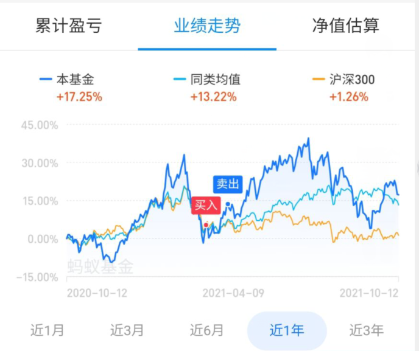

#### 国投瑞银军工

​	一样的，随便找个热门基金，然后找到暴跌超过30或者接近30的。经历了上次的医疗，我开始发觉，自己没吃到收益非常的亏，而且如果当时我抄底它抄我家的话非常危险，我就开始着手定投。定投策略也非常幼稚，就是你跌一次，我投一次，你涨我就不投。（这样的策略大体正确，但是没有办法保证吃到大额的收益,尤其在缓慢上升阶段）这次也没想到军工能涨的这么离谱但是和我的目标收益率相符了，所以我就跑了。

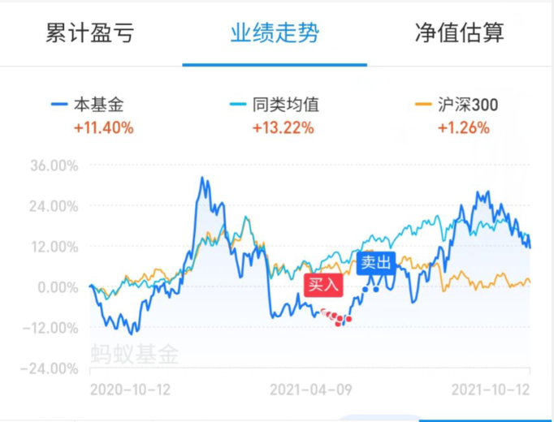

#### 景顺长城白酒

​	景顺长城是我最近在玩的白酒基，说白了，什么热门基金跌破30，什么地方就会出现我。如期而至，我这次采取的定投策略更加精确，比如我投入周期是1个月，空闲资金是3000，那我就分成30份，每天定投。根据当天的上涨和下跌来买，比如跌了百分之1我可能就买120，2个点就150。涨了百分之1就买80，涨了百分之2就50，再涨不买了。（这样的策略能把子弹最好的打在关键部位，收益也随之增高）。其实我本来打算连着买一个月了，直到有一天暴涨了6个点，给我整不会了，后续就放任了，超过15个点以后我开始逐步关注半导体了,10月13又暴涨百分之4，我跑了百分之30。

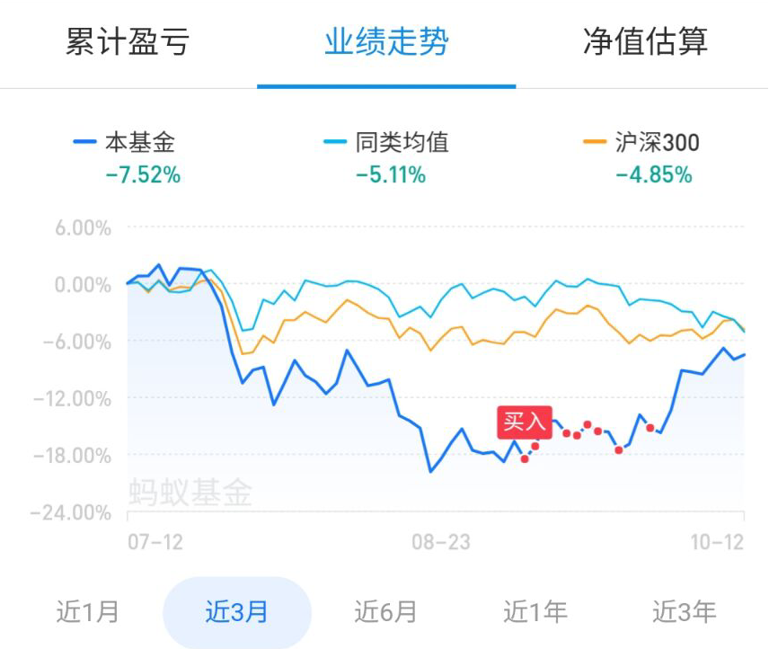

#### 诺安成长半导体

​	8月25吧，支付宝出了个基金投入100给50红包的活动，正好当时也想找找看什么基金适合我下一步布局。然后就丢绣球般的砸中了菜狗。10块钱进场，菜狗一点都没让我失望，跌成了8块多，我当时一看，机会来了。老规矩一天100，多跌多投。12号迎来了暴跌3.3个点，我当天投了300块钱，然后13号盈利2.4个点，索性吧先前的收益拿回来了，但是我还是不甘心，诶，不能再跌多点嘛。

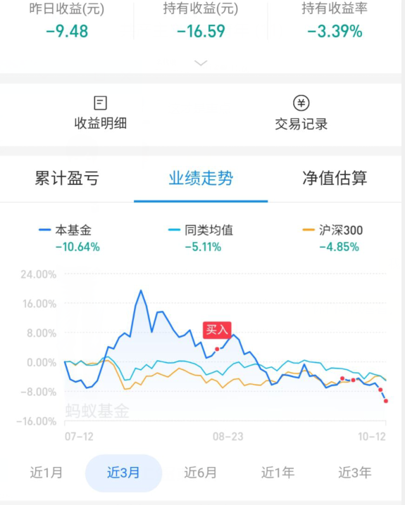

​	以下是截止2021年10月13日的基金涨幅情况和我目前持仓基金，目前年收益19个点吧，打算逐步吧基金全部转成半导体，希望半导体别涨了。

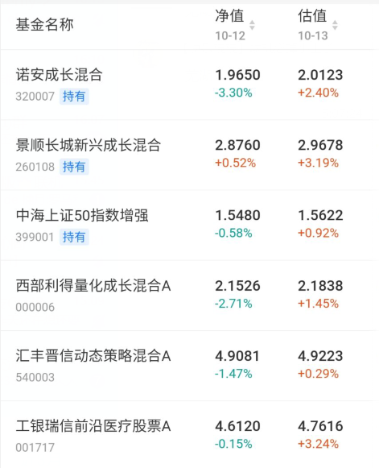

#### 总结

* 找热门震荡基金，白酒，医疗，新能源，军工，半导体，什么刺激找什么，然后找暴跌接近30的，其实20就可以插眼了，比如诺安，我就是跌了18开始插眼。

* 定投策略：你闲散资金3000，预期时间30天，就1天100，涨了就少投，跌了就多投。

### 基金止盈策略

​	下面是我自己的止盈策略和网上的五大止盈策略（侵删），大家可以参考下：

#### 个人止盈策略

​	你设置一个预期值，比如盈利百分之30就跑，那么到达百分之10-15的时候可以跑百分之30，然后等再到答20的时候再留下百分之50，剩下的跑掉，最后到预期值了再全跑。但是你要设置一个预警，就比如形势大好的情况下，跌了10个点，那么这时候要毫不犹豫的全抛了，因为这种情况下，就是到小高峰了。

#### 五大基金止盈策略

**一、累计收益率止盈法**

达到绝对收益率时，止盈全部卖出。

通常**目标收益率设为20%，之后每年目标收益率递增10%**，比如第二年至第三年则为30%止盈。

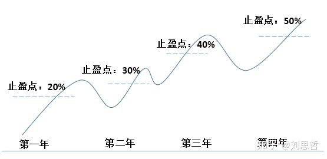

**案例：**

每月定投1000元中证500，投资36个月后，共投入36000元，而账面总金额为50400元，浮盈达到40%，触发止盈。

**策略优点：**

计算方法简单暴力，容易操作。

**策略缺点：**

牛市无法吃到全部的上涨行情，而且累计收益止盈是用单利加法而非乘法复利，因此时间拖得越长，年化收益越低。

**二、年化收益率止盈法**

定投达到目标年化收益率时，止盈全部卖出。

通常定投一般**10%年化止盈（IRR年化为20%左右）**，达到账面年化收益时全部卖出，重新布局定投。

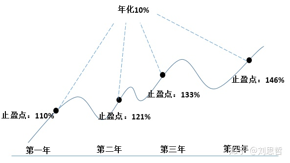

**案例：**

每月定投1000元中证500，投资24个月后，共投入24000元，而账面总金额为29040元，年化收益达到10%，触发止盈。

**策略优点：**

能获得固定的预期年化回报率。

**策略缺点：**

和之前策略一样，牛市也无法“吃”到全部的上涨行情，另外，如后续市场没有较大的行情，可能将一直无法触发止盈。

**三、割韭菜止盈法**

每次盈利达到一定比例，则卖出盈利部分，边涨边卖。

一般割韭菜止盈设置为10%比较合适，即**每上涨10%，则卖出额外的10%的利润部分**，从而保持本金不变，持续盈利。

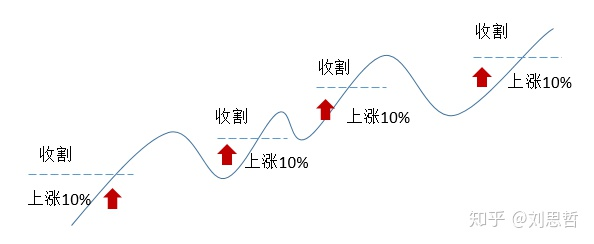

**案例：**

每月定投1000元中证500，投资24个月后，共投入24000元，而账面总金额为26400元，上涨10%，此时将2400元超额收益部分全部卖出，保留本金。

**策略优点：**

适合单边牛市行情，如果能持续上涨100%甚至200%，可以提前收割回本金，后续还能继续获取超额收益，而不用担心高位崩盘的风险。

**策略缺点：**

由于账户始终保留本金，需要承担更大的投资风险。

**四、回落止盈法**

在保证一定盈利的基础上，只要回撤超过一个阈值，则进行止盈。

通常在**保证20%以上的累计盈利下，一旦途中收益率回撤超过10%，则进行止盈**。

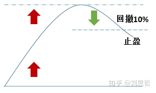

**案例：**

每月定投1000元中证500，投资24个月后，共投入2.4万元，而账面总金额达到了4.8万元，收益率为100%，随后几天市场震荡下滑，收益率下降到了90%，变为4.56万元，此时全部卖出止盈。

**策略优点：**

最适合牛市行情，采用此法，在牛市获得大幅超额收益后，即使之后市场崩盘也可以成功逃离。

**策略缺点：**

在震荡向上的行情下，容易因市场回调被“抖”出来，此时就错过了行情。

**五、估值止盈法**

此法适合指数基金止盈。

目前市场上有很多做指数估值的软件可以参考，比如阿牛定投、且慢等等，但是他们衡量的指标都以市盈率百分位为唯一标准。

市盈率百分位虽然可以一定程度上反应估值历史相对高低，但由于指数的增长不但与估值有关，也与自生成长性有关，因此我自己把更多指标纳入我考量的模型，进行指数估值。

我主要是根据PE比率、PB比率、ROE、PEG、盈利收益率等指标来判断，绘制了如下估值图。

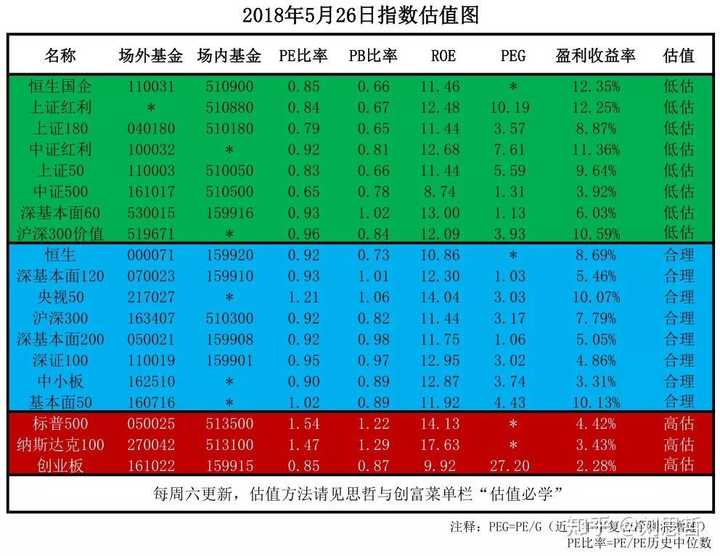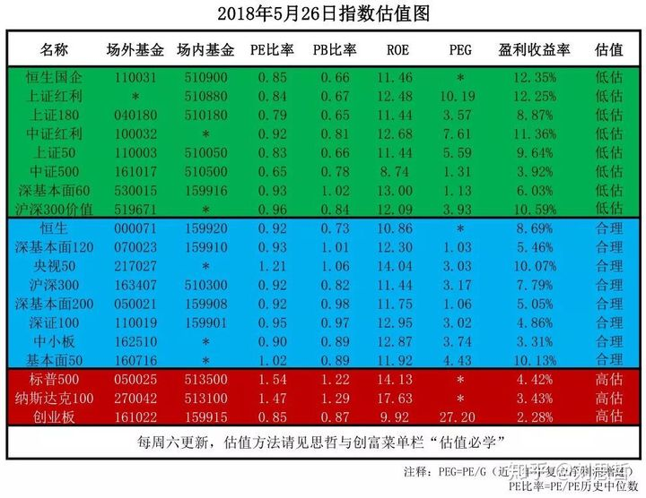

如果你定投的指数在我做的估值图中，当**估值表中指数的状态由低估（绿色）或合理（蓝色）进入了高估（红色），此时则卖出止盈，转而定投处于低估值的指数**。

估值图会在我的公众号“思哲与创富”中每周六更新。

**案例：**

中证500在估值表中为“低估值”指数，此时每月定投中证500，投资一定时间后，指数估值显示为“高估”，此时将中证500全部卖出，重新定投处于低估值的指数基金，如果表格中的指数全部显示为“高估”，则停止定投。

**策略优点：**

追踪成长价值高、估值低的指数，比始终定投单一指数能获得更好的超额收益，且根据估值表能判断大盘风向，如市场全是高估值指数，说明此时泡沫严重，不宜入场。

**策略缺点：**

由于估值模型是思哲根据相关数据制作，虽经过数据回撤表明估值模型有效，但市场变化多测，极端情况可能导致估值失效。

**针对前面几种止盈方法，止盈赎回后的大笔资金应该怎么办？**

如果是指数基金，这时我建议看一下多个平台参考一下指数的估值情况，如果仍然处于低估值区间，则可以继续定投此指数。

如果该指数处于高估值状态，则可以换一个低估值的指数进行定投。

可以把存量资金分成12个月12批来进行定投。

**选择哪种止盈策略最好呢？** 

由于上述止盈策略都有一定局限性，所以并没有定论，**选择最适合自己的方法即可，不管如何，只要坚持定投，终会等到你收割的那天。**

