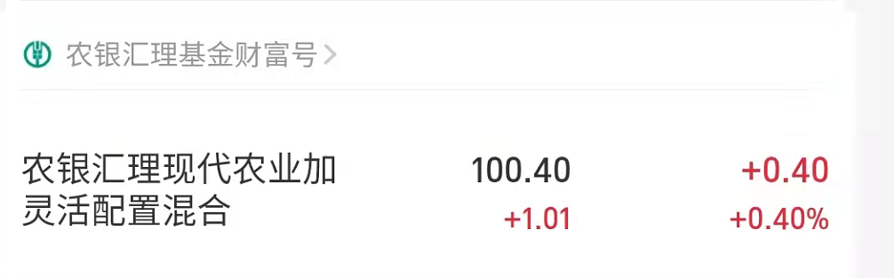

### 定投计划表（全是自己在学习和试验，如果有跟着的，盈亏自负）

#### 2021.9.10
* 白酒  
* 半导体
* 开始找寻债券

#### 2021.10.13
* 白酒收益：14%，回撤35个点，目前已经回温15个点，准备抛去百分之30，转投半导体。
* 半导体收益：-3%，回撤29个点，昨天又掉了3.4个点，目前回撤33.4，历史最高回撤34个点，目前市场没有利好，逐步定投。
* 中证50收益：3%，没多大意思，把重仓的白酒去除后，升降都很没劲，但是逐步把银行和债券加入，对于目前美林时钟而言是正确的。
* 债券寻找完成，原因：中证50抛去了所有白酒基，转投银行，债券，保险，符合美林时钟。但不是很刺激，可能当成储蓄先慢慢定投，反正美林时钟迟早要转到的。

接下去寻找止盈策略，学习止盈，基金学习最重要的地方就是投入时间和止盈时间，目前我需要止盈，现学现卖。

####  2021.10.30

目前截止10月30号前，我的持仓如下：

* 白酒收益：5.84%，止盈了一波，在高点卖出，但是贪心了，看到下跌以后又补了仓，降低了整体收益率，索性，因为卖出的是高点，所以亏也亏的不多。近期计划：持仓到过年，赚得多了就减仓。

* 半导体收益：3.95%，和先前预料的一样，最高回撤34%，我买入的时候已经是29%了，再低也不会低到哪去，所以开始反弹了。近期计划：这波打算持有到15再抛掉百分之30。后面逢低就低吸，做T。

* 上证50收益：2.87%，和上次一个评价，没多大意思，就是一个稳定的基金，关键跑不过通货，玩多久都白玩，只能说当成储蓄存着了。近期计划：这个钱就不动了。

* 农业：先丢100插个眼，每年快过年11月初到过年这段时间都是农业的优势期，大约到11月左右，我会开始逐步定投农业，大约用1个月时间达到满仓状态。

* 白色家电收益：-3.38%。想赚一波快钱，根据曲线白色家电会在10月20到双11的时候飞升15-30个点，就算亏，也不会亏超过10个点，玩基金其实更像是玩概率游戏，这波明显，我的赚头大，输头小，所以我丢了一笔钱在上面。没想到董明珠给了我个惊喜。。。第三季度财报直接炸了，但是并不影响双11的进行，计划：我会在双11的时候再指定一波定投计划，回头就抛售白色家电，当然如果还是亏的，不排除等待双12的可能性。

 

